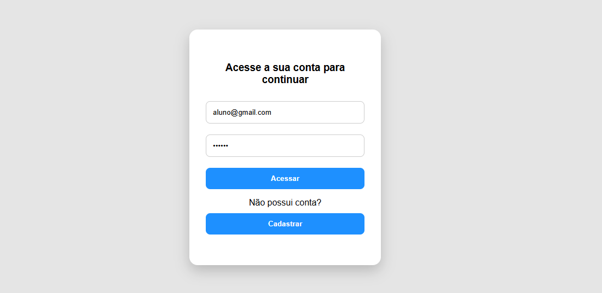
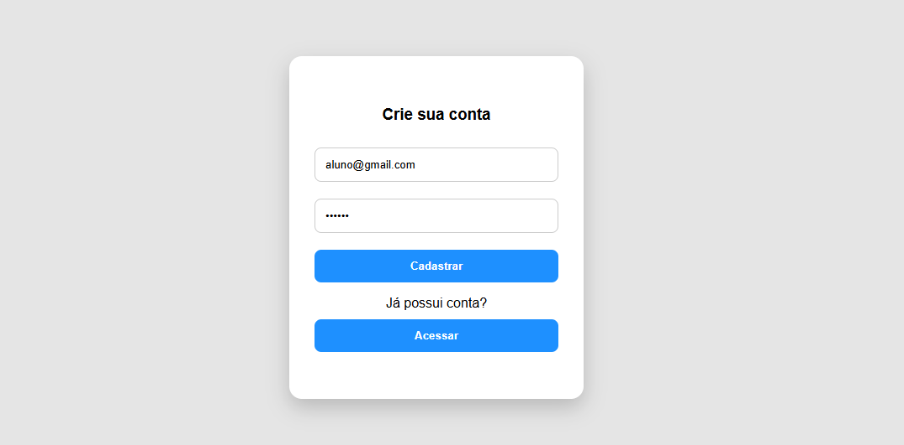
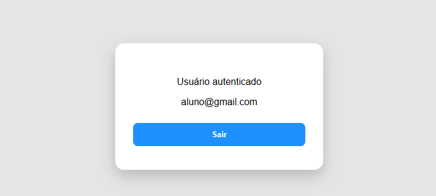
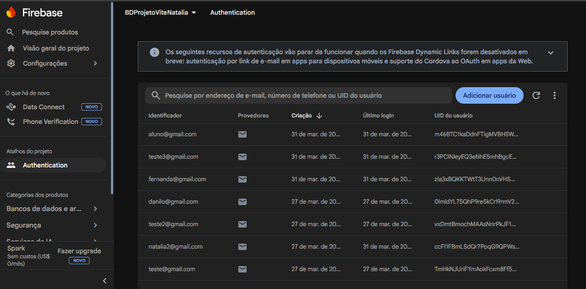

# 🔐 Firebase Authentication App

## 📌 Descrição

Este projeto é uma aplicação web desenvolvida com React que utiliza o Firebase Authentication para realizar cadastro, login e gerenciamento de sessão de usuários.

A aplicação permite que usuários criem uma conta com e-mail e senha, façam login e permaneçam autenticados mesmo após recarregar a página.

---

## 🚀 Funcionalidades

* Cadastro de usuário com e-mail e senha
* Login de usuário
* Tratamento de erros:

  * Email inválido
  * Senha fraca
  * Usuário não encontrado
  * Senha incorreta
* Persistência de sessão com Firebase
* Logout de usuário
* Interface dinâmica (altera conforme autenticação)
* Loading durante autenticação

---

## 🛠 Tecnologias utilizadas

* React (Vite)
* Firebase Authentication
* JavaScript (ES6+)
* CSS

---

## 🔥 Configuração do Firebase

Para utilizar o Firebase Authentication, siga os passos:

1. Acesse: https://console.firebase.google.com/
2. Clique em **"Criar projeto"**
3. Vá em **Authentication**
4. Clique em **"Get started"**
5. Na aba **"Sign-in method"**, ative:

   * Email/Password
6. Vá em **Configurações do projeto**
7. Em **"Seus apps"**, adicione um app Web
8. Copie as credenciais

Crie o arquivo `firebase.js`:

```javascript
import { initializeApp } from "firebase/app";
import { getAuth } from "firebase/auth";

const firebaseConfig = {
  apiKey: "SUA_API_KEY",
  authDomain: "SEU_DOMINIO",
  projectId: "SEU_PROJECT_ID",
  storageBucket: "SEU_BUCKET",
  messagingSenderId: "SEU_ID",
  appId: "SEU_APP_ID"
};

const app = initializeApp(firebaseConfig);
export const auth = getAuth(app);
```

---

## 📂 Estrutura do projeto

```
src/
│
├── components/
│   ├── AuthForm.jsx
│   ├── UserContent.jsx
│   └── Loading.jsx
│
├── services/
│   └── auth.js
│
├── firebase.js
├── App.jsx
└── App.css
```

---

## ▶️ Como executar o projeto

### 1. Clonar o repositório

```bash
git clone https://github.com/nataliarodrigues81/projeto-react-vite-firebase.git
```

---

### 2. Acessar a pasta do projeto

```bash
cd projeto-react-vite-firebase
```

---

### 3. Instalar as dependências

```bash
npm install
```

---

### 4. Rodar o projeto

```bash
npm run dev
```

---

### 5. Abrir no navegador

Acesse:

```
http://localhost:5173/
```

---

## 📸 Prints da aplicação

### Tela de Login


### Tela de Cadastro


### Usuário Autenticado


### Tela de Usuários


---

## 👩‍💻 Autora

Natália Rodrigues

---

## 📚 Aprendizados

Durante o desenvolvimento deste projeto, foram aplicados:

* Componentização no React
* Separação de responsabilidades
* Uso de useState e useEffect
* Integração com Firebase Authentication
* Manipulação de estado de autenticação

---

## ✅ Status do projeto

✔ Concluído
